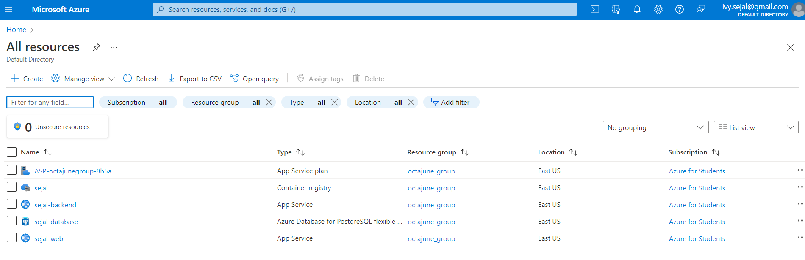
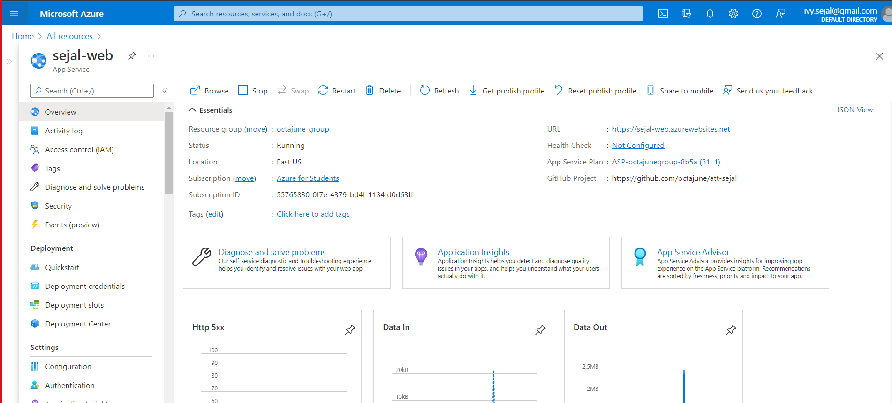
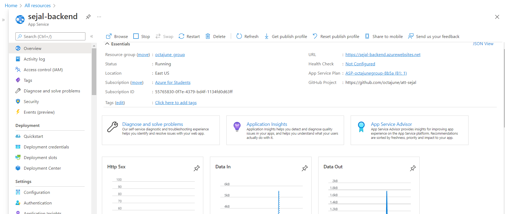
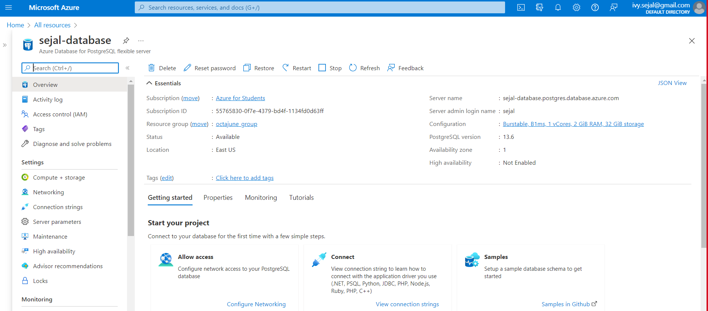
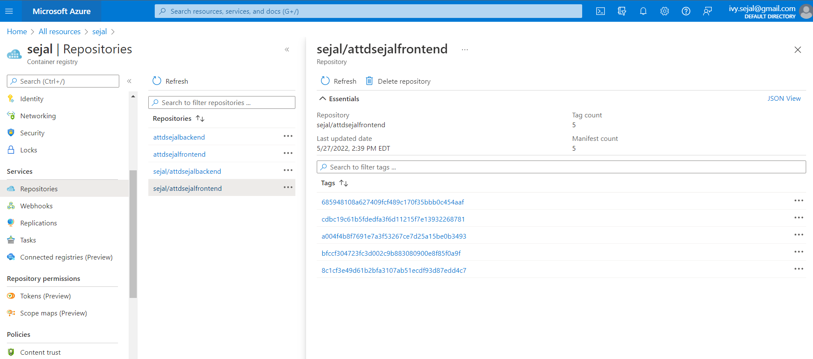
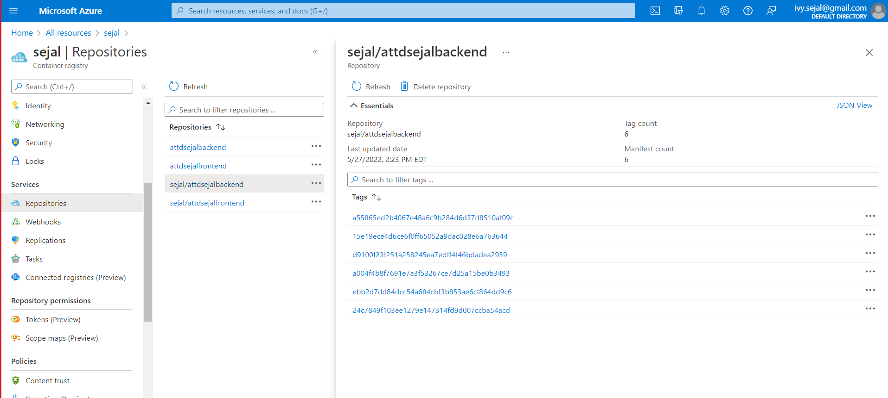

# Azure Setup

## Introduction
I used Azure for hosting because for the Azure Subscription for Students and I found the UI to be very engaging. The front-end and backend applications are running as different docker containers which are present in the same App Service Plan. Both these Azure app services are configured to use CI/CD and deployment on them is triggered through GitHub Actions

## Azure Screenshots

## License
- Licensed under [MIT](https://github.com/octajune/att-sejal/blob/main/LICENSE)

## Thank you Microsoft
I can't be more thankful to Microsoft for offering me this opportunity. I learnt a lot from the past 4 weeks.

 

Made with ❤️ by Sejal

