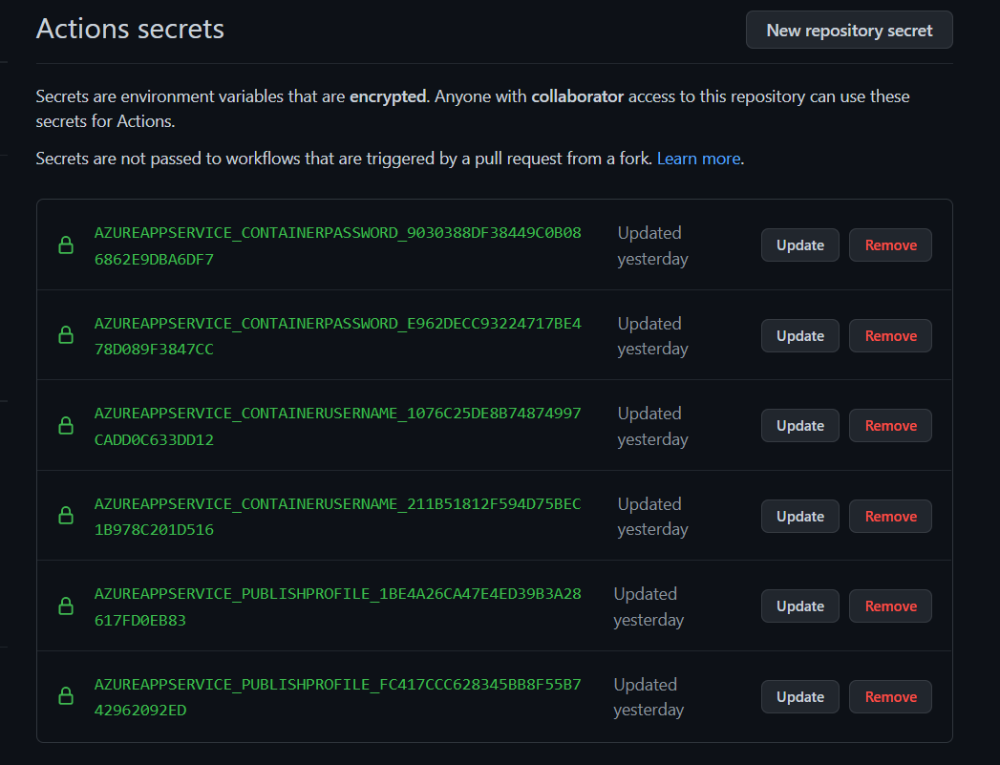
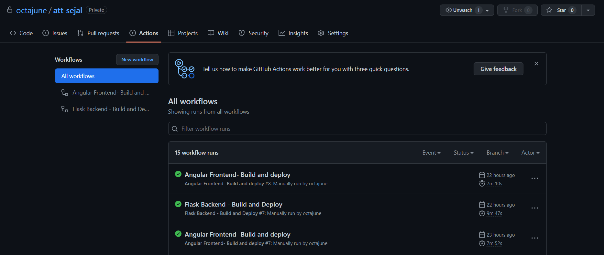
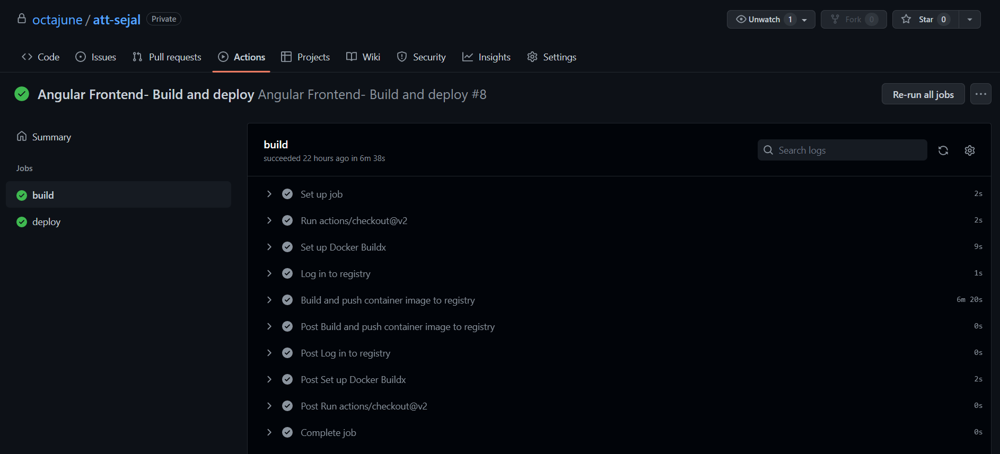
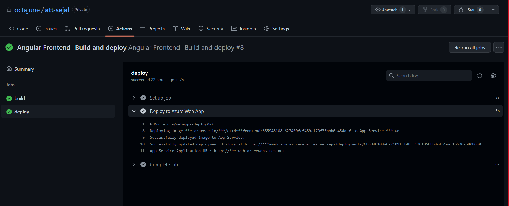
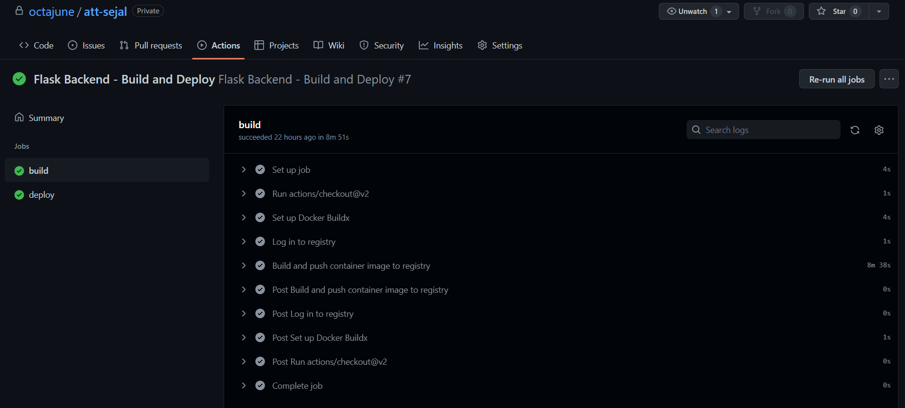
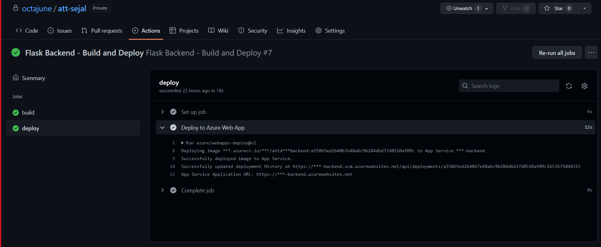

# CI/CD
## Why I used Containerization and CI/CD?
My mentor mentioned in on of our meetings that he would be really surprised if he sees someone implement CI/CD in the project. I studied more about CI/CD and my search led me to containers. As per my understanding, a docker container is like a new machine which can be configured from scratch. 
<br />
Once I understood the concept behind dockers, it was relatively easy find suitable Dockerfiles for my project and then configure my application to run with them. I used the `docker` extension in VSCode for my testing.

<hr />

## Frontend CI/CD

It uses `ubuntu-latest` as the build container. The docker image is build here and `context: ./attd-sejal-frontend` specifies the location of the angular folder. The pipeline automatically detects the `Dockerfile` present in this location and builds it. The file was automatically generate by Azure App Service, which I later modified to work for me :)
```
name: Angular Frontend- Build and deploy

on:
  workflow_dispatch:

jobs:
  build:
    runs-on: 'ubuntu-latest'

    steps:
    - uses: actions/checkout@v2

    - name: Set up Docker Buildx
      uses: docker/setup-buildx-action@v1

    - name: Log in to registry
      uses: docker/login-action@v1
      with:
        registry: https://sejal.azurecr.io/
        username: ${{ secrets.AzureAppService_ContainerUsername_1076c25de8b74874997cadd0c633dd12 }}
        password: ${{ secrets.AzureAppService_ContainerPassword_e962decc93224717be478d089f3847cc }}

    - name: Build and push container image to registry
      uses: docker/build-push-action@v2
      with:
        push: true
        tags: sejal.azurecr.io/${{ secrets.AzureAppService_ContainerUsername_1076c25de8b74874997cadd0c633dd12 }}/attdsejalfrontend:${{ github.sha }}
        context: ./attd-sejal-frontend

  deploy:
    runs-on: ubuntu-latest
    needs: build
    environment:
      name: 'production'
      url: ${{ steps.deploy-to-webapp.outputs.webapp-url }}

    steps:
    - name: Deploy to Azure Web App
      id: deploy-to-webapp
      uses: azure/webapps-deploy@v2
      with:
        app-name: 'sejal-web'
        slot-name: 'production'
        publish-profile: ${{ secrets.AzureAppService_PublishProfile_1be4a26ca47e4ed39b3a28617fd0eb83 }}
        images: 'sejal.azurecr.io/${{ secrets.AzureAppService_ContainerUsername_1076c25de8b74874997cadd0c633dd12 }}/attdsejalfrontend:${{ github.sha }}'
```

<hr />

## Backend CI/CD
It uses `ubuntu-latest` as the build container. The docker image is build here and `context: ./attd-sejal-backend` specifies the location of the angular folder. The pipeline automatically detects the `Dockerfile` present in this location and builds it. The file was automatically generate by Azure App Service, which I later modified to work for me :)
```
name: Flask Backend - Build and Deploy

on:
  workflow_dispatch:

jobs:
  build:
    runs-on: 'ubuntu-latest'

    steps:
    - uses: actions/checkout@v2

    - name: Set up Docker Buildx
      uses: docker/setup-buildx-action@v1

    - name: Log in to registry
      uses: docker/login-action@v1
      with:
        registry: https://sejal.azurecr.io/
        username: ${{ secrets.AzureAppService_ContainerUsername_211b51812f594d75bec1b978c201d516 }}
        password: ${{ secrets.AzureAppService_ContainerPassword_9030388df38449c0b086862e9dba6df7 }}

    - name: Build and push container image to registry
      uses: docker/build-push-action@v2
      with:
        push: true
        tags: sejal.azurecr.io/${{ secrets.AzureAppService_ContainerUsername_211b51812f594d75bec1b978c201d516 }}/attdsejalbackend:${{ github.sha }}
        context: ./attd-sejal-backend

  deploy:
    runs-on: ubuntu-latest
    needs: build
    environment:
      name: 'production'
      url: ${{ steps.deploy-to-webapp.outputs.webapp-url }}

    steps:
    - name: Deploy to Azure Web App
      id: deploy-to-webapp
      uses: azure/webapps-deploy@v2
      with:
        app-name: 'sejal-backend'
        slot-name: 'production'
        publish-profile: ${{ secrets.AzureAppService_PublishProfile_fc417ccc628345bb8f55b742962092ed }}
        images: 'sejal.azurecr.io/${{ secrets.AzureAppService_ContainerUsername_211b51812f594d75bec1b978c201d516 }}/attdsejalbackend:${{ github.sha }}'
```

## My Actions Secrets


<hr />

## Github Actions in Action






<hr />

## License
- Licensed under [MIT](https://github.com/octajune/att-sejal/blob/main/LICENSE)

## Thank you Microsoft
I can't be more thankful to Microsoft for offering me this opportunity. I learnt a lot from the past 4 weeks.

<hr /><br />
<center>Made with ❤️ by Sejal</center>