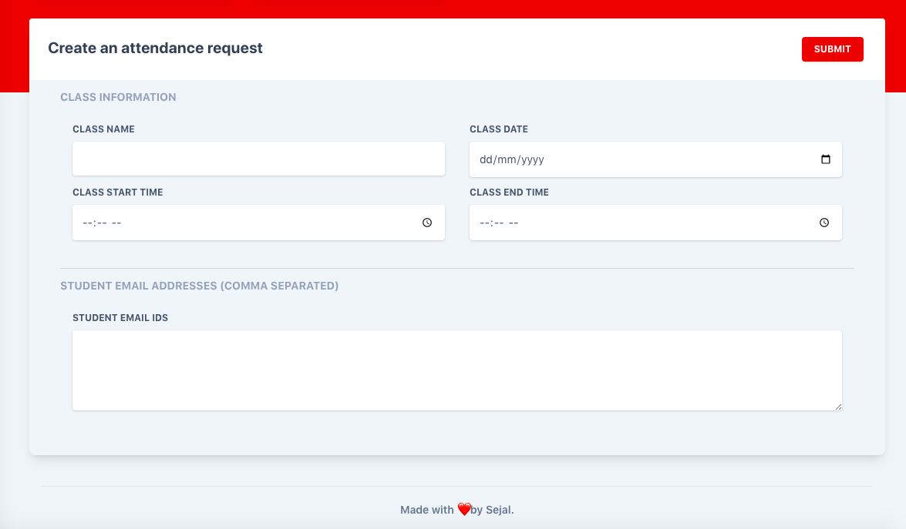

# Angular Frontend

My website can be accessed from http://sejal-web.azurewebsites.net/

## Table of contents 

- Get Started
- Pages
- Files and folder
- Gallery
- Browser support
- Libraries Used
- License

## Get Started

- Install VSCode
- Download the product of this page (attd-frontend)
- Unzip the downloaded file to a folder in your computer
- Open the application folder with the help of Intellij
- Open the Terminal and run 
bash
    npm install
  
- Run in terminal 
bash
    npm start

- Navigate to https://localhost:4200/  

With help of [Notus Angular](https://github.com/creativetimofficial/notus-angular), I'm able to create this amazing UI with cool features for my project.


## Pages

Here are all the page from the project:

#### Presentation
#### Teacher Pages
- [Create class](https://github.com/octajune/att-sejal/tree/main/attd-sejal-frontend/src/app/views/admin/create_class)
- [Dashboard](https://github.com/octajune/att-sejal/tree/main/attd-sejal-frontend/src/app/views/admin/dashboard)
- [Tables](https://github.com/octajune/att-sejal/tree/main/attd-sejal-frontend/src/app/views/admin/tables)
#### Authentication Pages
- [Login](https://github.com/octajune/att-sejal/tree/main/attd-sejal-frontend/src/app/views/auth/login)
- [Register](https://github.com/octajune/att-sejal/tree/main/attd-sejal-frontend/src/app/views/auth/register)
#### Lading Page
- [Landing](https://github.com/octajune/att-sejal/tree/main/attd-sejal-frontend/src/app/views/landing)
#### Student pages
- [Mark Attendance](https://github.com/octajune/att-sejal/tree/main/attd-sejal-frontend/src/app/views/student/mark_attendance)
- [Student Dashboard](https://github.com/octajune/att-sejal/tree/main/attd-sejal-frontend/src/app/views/student/student_dashboard)

## Files and folder

This is the project structure that you will get upon the download:

```
att-sejal
.
├── src
│   ├── app
│   │   ├── app-routing.module.ts
│   │   ├── app.component.html
│   │   ├── app.component.ts
│   │   ├── app.module.ts
│   │   ├── components
│   │   │   ├── cards
│   │   │   │   ├── card-bar-chart
│   │   │   │   │   ├── card-bar-chart.component.html
│   │   │   │   │   └── card-bar-chart.component.ts
│   │   │   │   ├── card-line-chart
│   │   │   │   │   ├── card-line-chart.component.html
│   │   │   │   │   └── card-line-chart.component.ts
│   │   │   │   ├── card-page-visits
│   │   │   │   │   ├── card-page-visits.component.html
│   │   │   │   │   └── card-page-visits.component.ts
│   │   │   │   ├── card-profile
│   │   │   │   │   ├── card-profile.component.html
│   │   │   │   │   └── card-profile.component.ts
│   │   │   │   ├── card-settings
│   │   │   │   │   ├── card-settings.component.html
│   │   │   │   │   └── card-settings.component.ts
│   │   │   │   ├── card-social-traffic
│   │   │   │   │   ├── card-social-traffic.component.html
│   │   │   │   │   └── card-social-traffic.component.ts
│   │   │   │   ├── card-stats
│   │   │   │   │   ├── card-stats.component.html
│   │   │   │   │   └── card-stats.component.ts
│   │   │   │   └── card-table
│   │   │   │       ├── card-table.component.html
│   │   │   │       └── card-table.component.ts
│   │   │   ├── dropdowns
│   │   │   │   ├── index-dropdown
│   │   │   │   │   ├── index-dropdown.component.html
│   │   │   │   │   └── index-dropdown.component.ts
│   │   │   │   ├── notification-dropdown
│   │   │   │   │   ├── notification-dropdown.component.html
│   │   │   │   │   └── notification-dropdown.component.ts
│   │   │   │   ├── pages-dropdown
│   │   │   │   │   ├── pages-dropdown.component.html
│   │   │   │   │   └── pages-dropdown.component.ts
│   │   │   │   ├── table-dropdown
│   │   │   │   │   ├── table-dropdown.component.html
│   │   │   │   │   └── table-dropdown.component.ts
│   │   │   │   └── user-dropdown
│   │   │   │       ├── user-dropdown.component.html
│   │   │   │       └── user-dropdown.component.ts
│   │   │   ├── footers
│   │   │   │   ├── footer
│   │   │   │   │   ├── footer.component.html
│   │   │   │   │   └── footer.component.ts
│   │   │   │   ├── footer-admin
│   │   │   │   │   ├── footer-admin.component.html
│   │   │   │   │   └── footer-admin.component.ts
│   │   │   │   └── footer-small
│   │   │   │       ├── footer-small.component.html
│   │   │   │       └── footer-small.component.ts
│   │   │   ├── headers
│   │   │   │   └── header-stats
│   │   │   │       ├── header-stats.component.html
│   │   │   │       └── header-stats.component.ts
│   │   │   ├── maps
│   │   │   │   └── map-example
│   │   │   │       ├── map-example.component.html
│   │   │   │       └── map-example.component.ts
│   │   │   ├── navbars
│   │   │   │   ├── admin-navbar
│   │   │   │   │   ├── admin-navbar.component.html
│   │   │   │   │   └── admin-navbar.component.ts
│   │   │   │   ├── auth-navbar
│   │   │   │   │   ├── auth-navbar.component.html
│   │   │   │   │   └── auth-navbar.component.ts
│   │   │   │   ├── index-navbar
│   │   │   │   |    ├── index-navbar.component.html
│   │   │   │   |    └── index-navbar.component.ts
|   |   |   |   └── student-navbar
│   │   │   │       ├── student-navbar.component.html
│   │   │   │       └── admin-navbar.component.ts
│   │   │   ├── sidebar
│   │   │   |    ├── sidebar.component.html
│   │   │   |    └── sidebar.component.ts
|   |   |   └── sidebar-student
│   │   │       ├── sidebar_student.component.html
│   │   │       └── sidebar_student.component.ts
│   │   ├── layouts
│   │   │   ├── admin
│   │   │   │   ├── admin.component.html
│   │   │   │   └── admin.component.ts
│   │   │   ├── auth
│   │   │   |    ├── auth.component.html
│   │   │   |    └── auth.component.ts
|   |   |   └── student
│   │   │        ├── student.component.html
│   │   │        └── admin.component.ts
|   |   |
│   │   └── views
│   │       ├── admin
|   |       |   ├── create class
│   │       │   │   ├── create_class.component.html
│   │       │   │   └── create_class.component.ts
│   │       │   ├── dashboard
│   │       │   │   ├── dashboard.component.html
│   │       │   │   └── dashboard.component.ts
│   │       │   ├──maps
│   │       │   |    ├── maps.component.html
│   │       │   |    └── maps.component.ts
│   │       │   ├──settings
│   │       │   |    ├── settings.component.html
│   │       │   |    └── settings.component.ts
│   │       │   └── tables
│   │       │       ├── tables.component.html
│   │       │       └── tables.component.ts
│   │       ├── auth
│   │       │   ├── login
│   │       │   │   ├── login.component.html
│   │       │   │   └── login.component.ts
│   │       │   └── register
│   │       │       ├── register.component.html
│   │       │       └── register.component.ts
│   │       ├── index
│   │       │   ├── index.component.html
│   │       │   └── index.component.ts
│   │       ├── landing
│   │       │   ├── landing.component.html
│   │       │   └── landing.component.ts
│   │       ├── profile
│   │       │   ├── profile.component.html
│   │       │   └── profile.component.ts
|   |       ├── student
|   |       |    └── mark attendance
|   |       |        ├── mark_attendance.component.html
|   |       |        └── mark_attendance.component.ts
│   │       ├── student_dashboard
│   │       │      ├── student_dashboard.component.html
│   │       │      └── student_dashboard.ts
```

## Gallery





## Browser Support

| Browser           | Logos                                                                |
| ----------------- | ------------------------------------------------------------------ |
| Chrome            | |
| Firefox           | |
| Edge              | |
| Safari            | |
| Opera             | |

## Libraries Used
```
"@angular/animations": "11.2.5",
"@angular/common": "11.2.5",
"@angular/compiler": "11.2.5",
"@angular/core": "11.2.5",
"@angular/forms": "11.2.5",
"@angular/platform-browser": "11.2.5",
"@angular/platform-browser-dynamic": "11.2.5",
"@angular/router": "11.2.5",
"@fortawesome/fontawesome-free": "5.15.3",
"@popperjs/core": "2.9.1",
"@tailwindcss/forms": "0.2.1",
"chart.js": "2.9.4",
"ngx-toastr": "^13.0.0",
"ngx-webcam": "^0.3.0",
"rxjs": "6.6.6",
"tailwindcss": "2.0.4",
"ts-md5": "^1.2.11",
"tslib": "2.1.0",
"zone.js": "0.11.4"
```

<hr />

## License
- Licensed under [MIT](https://github.com/octajune/att-sejal/blob/main/LICENSE)

## Thank you Microsoft
I can't be more thankful to Microsoft for offering me this opportunity. I learnt a lot from the past 4 weeks.

<hr /><br />
<center>Made with ❤️ by Sejal</center>