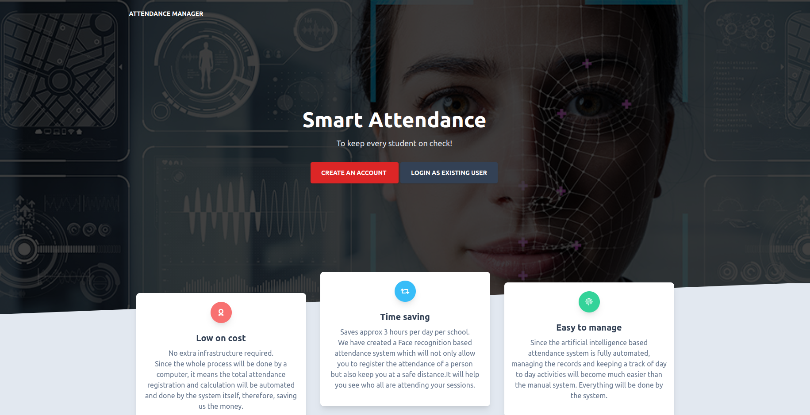
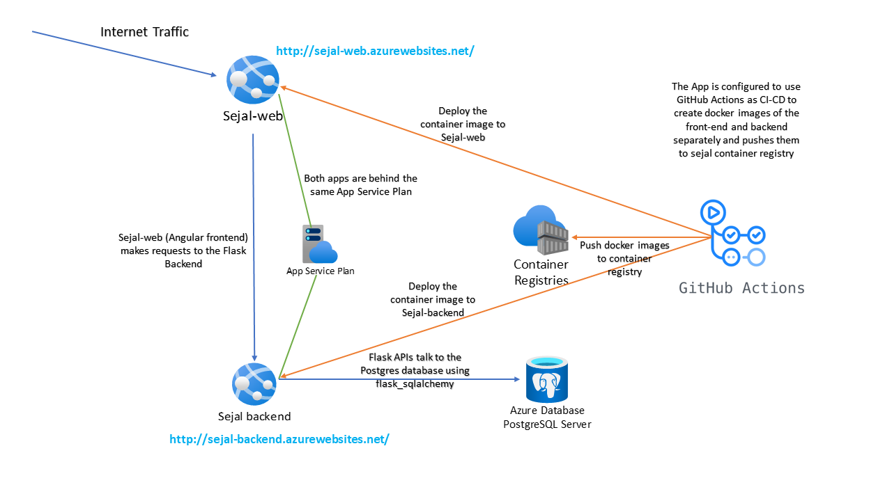

# Smart Attendance
 
 

## Introduction
 
The system works on facial recognition where each student in the class is photographed, and their details are stored on a server. The
teacher can record the attendance automatically in the classroom. The system will recognise the faces and verify the presence or
absence of each student. 

The website is currently hosted on: https://sejal-web.azurewebsites.net/ 

I have mocked the data for a teacher account (Username: ivy.sejal@gmail.com, Password: Sejal) and a student account (Username: suman.sharma@gmail.com, Password: suman) for easier evaluation

## Technology Stack
`CI/CD using GitHub Actions`, `Azure App Service`, `Azure Container Registry`, `Dockers`, `Docker-Compose`, `Python`, `Flask`, `Postgres`, `SQL-Alchemy`, `Facial Recognition`, `Angular`, `REST API`, `Token based authentication`

## System Architecture

These are the major points for the project:
- The FrontEnd application (sejal-web) is running on Angular and it is hosted on https://sejal-web.azurewebsites.net/.
- The Backend appication (Sejal backend) is running on Python Flask and it is hosted on https://sejal-backend.azurewebsites.net/
- Sejal Container Registry is a container registry which stores all the docker builds of my project under two tags (sejalfrontend and sejalbackend)
- This app supports CI/CD as well. The builds and deployment can be made through a single click at GitHub actions. I have removed the build with each commit for now, but we can add support for that as well.
- The below diagram sums up the high level architecture of my project.   

## Angular Frontend

<b>The documentation and screenshots for my frontend can be found at [Frontend.md](Frontend.md)<b>

## Flask Backend

<b>The documentation and API reference for the Flask API can be found at [Backend.md](Backend.md)<b>

## Facial Recognition
<b>The documentation for the image recognition algorithm used can be found at [ImageProcessing.md](ImageProcessing.md)<b>

## Postgres Database
<b>The documentation for the database model and tables used can be found at [DB.md](DB.md)<b>

## Azure Deployment
<b>I have the Azure deployment and my Azure setup for my project at [Azure.md](Azure.md)<b>

## Dockerization

<b>You can find the code and explaination of the code which I used to containerize my application here [Dockerization.md](Dockerization.md)<b>

## CI/CD
<b>You can find my explaination of the CI/CD approach and some screenshots of Github actions in action :) [CICD.md](CICD.md)<b>

## Token Based Authentication
<b>The documentation for the how the token based authentication works in my project is here [Authentication.md](Authentication.md)<b>

## Timeline

<b>My detailed timeline can be found here [Timeline.md](Timeline.md)<b>

## Local Environment Setup

### Just want to run it locally?
- Go to `attd-sejal/backend/app.py`
- Change the db url to use `app.config['SQLALCHEMY_DATABASE_URI'] = os.environ.get('DATABASE_URL')`
- run `sudo docker-compose up` from the root directory of the application
- The website must be running on `localhost:80`
- The Flask APIs must be running on `localhost:4200`

## My Development Setup

I love VSCode, and I can't recommend it enough. I have used the docker as well as Azure plugin to test my containers, build them, and deploy them. Once, I was confident then I configured CI-CD from GitHub Actions.

## License
- Licensed under [MIT](https://github.com/octajune/att-sejal/blob/main/LICENSE)

## Thank you Microsoft
I can't be more thankful to Microsoft for offering me this opportunity. I learnt a lot from the past 4 weeks.

 

Made with ❤️ by Sejal

